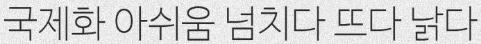
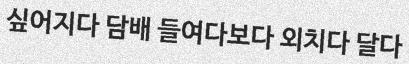
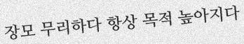
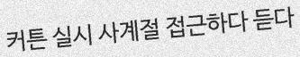
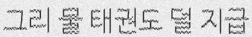
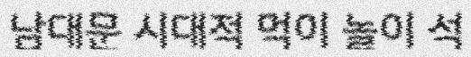
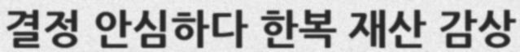
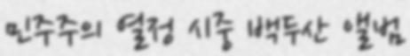
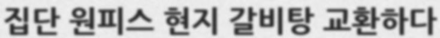
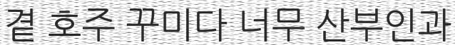

# 딥러닝을 활용한 한글문서 OCR 연구

## Introduction
광학 문자 인식(Optical character recognition; OCR)은 사람이 쓰거나 기계로 인쇄한 문자의 영상을 이미지 스캐너로 획득하여 기계가 읽을 수 있는 문자로 변환하는 것이다
이미지 스캔으로 얻을 수 있는 문서의 활자 영상을 컴퓨터가 편집 가능한 문자코드 등의 형식으로 변환하는 소프트웨어로써 일반적으로 OCR이라고 하며, OCR은 인공지능이나 기계 시각(machine vision)의 연구분야로 시작되었다.
OCR 기술은 크게 text detection(이미지 상에서 글자가 있는 영역을 찾는 걸 말함) 과 text recognition(찾은 영역을 바탕으로 글자를 분별해 내는걸 말함) 으로 구성되어 있고 OCR 기술이 어려운 점은 크게 3 가지이다. 
첫째로, 문서이미지 속 글자들은 정형화되어 있는 반면 보통 이미지 글자들은 비정형화 되어 있어 분별이 어렵다. 둘째로, 간판이나 벽돌 유리처럼 배경이 복잡해서 구분이 힘들다. 그리고 마지막으로 다양한 간섭요소, 예를 들면 노이즈, 왜곡, 글자들의 밀도, 저해상도, 로 인해 어려움이 있다. 
본 논문에서는 한글데이터셋을 구축, 문자 인식부분에 한글에 적합한 여러 기술들을 비교하여 한글문서의 OCR 성능을 높이기 위한 연구를 진행하였다.

## Updates
2019-08-11 훈련 및 검증 데이터셋 생성과정 설명추가,

## Getting started
### generate train/ validation data

1. fonts/ko 에 폰트를 추가한다 .ttf만 가능
    - [네이버 나눔글꼴](https://hangeul.naver.com/2017/nanum)(23종) 
    - [폰트코리아](http://www.font.co.kr/yoonfont/free/main.asp)(76종)  
2. dicts 에 한글 단어사전을 추가한다
    - [국립국어원 한국어 학습용 어휘목록](https://www.korean.go.kr/)  
3. 원하는 유형에 맞추어 데이터를 생성한다
    - [5개 유형 데이터 생성 bash](/data/generator/TextRecognitionDataGenerator/generate_data_5type.sh)  
    - basic  
        
        
        
    - skew  
        
        
        
    - distortion  
        
        
         
    - blurring  
         
         
         
    - background  
         
         
          

### create lmdb dataset
`python3 create_lmdb_dataset.py --inputPath data/ --gtFile data/gt.txt --outputPath result/`
         

   
   
   

